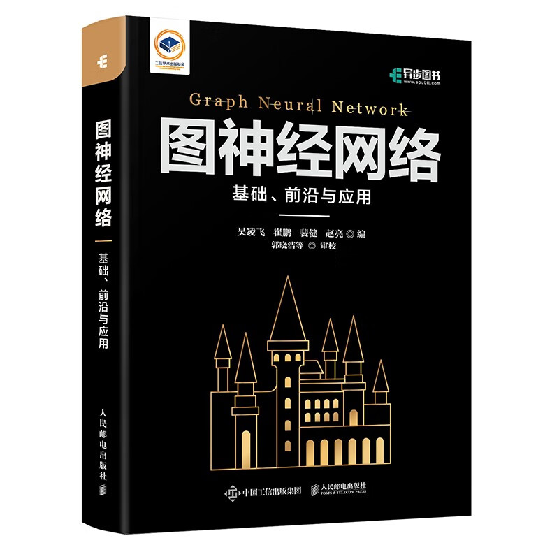

# 图神经网络_基础、前沿与应用

## 学习参考

本篇读书笔记全部来自于由异步图书出版的《图神经网络 基础、前沿与应用》一书。

有关图神经网络相关的学习建议学习斯坦福大学开设的CS224W公开课以及b站up主同济子豪兄的CS224W中文精讲公开课，链接如下：

CS224W公开课：[双语字幕 斯坦福CS224W《图机器学习》课程(2021) by Jure Leskove](https://www.bilibili.com/video/BV1RZ4y1c7Co?vd_source=55755af81e9ec7ae17d639fb86860235)

CS224W官方课程主页：[官方主页](https://web.stanford.edu/class/cs224w)

子豪兄中文精讲：[斯坦福CS224W图机器学习、图神经网络、知识图谱 同济子豪兄](https://www.bilibili.com/video/BV1pR4y1S7GA?vd_source=55755af81e9ec7ae17d639fb86860235)

我自己看课程的笔记分享：[CS224W笔记](https://github.com/lyc686/CS224W_notes/tree/main/notes)

## 一、引言

这本《图神经网络 基础、前沿与应用》从介绍什么是**表征学习**开始，引言部分一共包括了书的前三章“表征学习”、“图表征学习”、“图神经网络”。

## 第一章、表征学习

一个好的机器学习实践不仅取决于好的模型，更取决与一个好的数据，类比厨师（模型）做菜（处理数据）的时候没有一个好的食材（数据）肯定是很难去做出美味佳肴的。然而实际情况中当我们处理一些比较复杂的非欧数据的时候我们无法将数据直接输入到模型中，此时我们就需要对数据进行处理，将数据的特征用d维向量表示作为模型的输入。这种从数据得到d维特征向量的过程就叫做**嵌入**或者**表征/式学习**。常见的表征学习方法有**特征工程**和**图嵌入**，前一种方法需要人工基于**先验知识**去提取特征，而后一种方法是**端到端**的模式，只需要将数据输入模型，模型会自动提取特征完成任务。

### 1.传统的表征学习

传统的表征学习也可以叫做**特征工程**指的是利用人类的聪明才智和现有知识的一种方式，旨在从数据中提取并获得用于机器学习任务的判别信息，虽然这种方法确实行之有效，但是**缺点**也是十分突出的，包括：（1）通常需要领域专家的密集劳动和广泛合作（2）不完整的带有偏见的特征提取。

传统的表征学习方法属于**“浅层”模型**，旨在学习**数据转换**，使其在建立分类器或其他预测器时更容易提取有用的信息。

### 2.基于深度学习的表征学习

基于深度学习的表征学习则是由**多个非线性变换**组成的，目的是产生**更抽象**且**更有用**的表征。具体可以分为三种类型（1）有监督学习：需要通过大量的有标签数据训练深度学习模型（2）无监督学习：利用没有标签的数据，学习数据的潜在固有结构或分布（3）迁移学习：利用任何知识资源增加模型对目标任务的学习和泛化能力。

### 3.评价表征的好坏

定义什么是好的表征很重要，在建立分类器和其他预测器的时候，基于表征更容易提取有用的信息。因此，对所学表征的评价与其在**下游任务**中的表现密切相关。

### 4.不同领域的表征学习

#### （1）图像处理中的表征学习

图像表征学习是理解各种视觉数据（照片，文件扫描，视频流等）的**语义**的一个基本问题。通常情况下，图像处理中的图像表征学习的目标是像素数据和图像语义之间的语义差距。

（1）有监督表征学习

监督学习是根据大量有标签的数据完成训练任务，比如卷积神经网络可以用于解决图像分类问题能够取得良好的效果很大程度上取决于**平移不变性**，**权值共享**，**局部模式**等特性。而且随着深度学习的发展模型的深度逐渐加深，参数量逐渐变大，能够解决越来越复杂的问题。

（2）无监督表征学习

为了减少大量的人工标注工作，人们提出了许多用于从大规模**无标签**的图像或视频中提取特征的无监督方法。一种流行的解决方案是提出各种**代理任务**供模型解决，模型则通过学习代理任务的目标函数进行训练，并通过这个过程学习特征。当我们使用代理任务进行训练的时候深度神经网络模型**浅层**往往侧重于一些**一般的**特征，比如边缘，纹理等等，而随着模型的加深，所提取的特征会越来越**具体**，越来越具有**语义特征**。

（3）迁移学习

迁移学习可以使用在其他相关领域（源领域）的足够数量的**先验知识**，一般一个迁移学习任务只有一个目标领域，但是可以存在一个或多个源领域。例如使用一个在花卉中完成的分类任务作为另一个植物类领域的预训练模型，我们可以直接使用花卉分类中的参数文件和模型，在此基础上通过很少轮次的学习会比从0开始简单很多（**站在巨人的肩膀上**）。

注：但是当目标领域和源领域相差较大的时候往往直接在预训练模型上使用较少轮次的训练效果不会很理想，可以加大训练轮次或者重新训练模型的全部参数。

#### （2）语音识别的表征学习

在语音识别领域和二维图像数据的最大区别在于图像可以作为一个整体或快进行分析，但是语音必须按照顺序格式，以捕获时间依赖性和模式。

（1）有监督表征学习

在语音识别领域常见的有监督表征学习比如我们之前提到的卷积神经网络-CNN，引入了时序信息的循环神经网络-RNN、学习局部和长期依赖的-LSTM和GRU

（2）无监督表征学习

在语音识别领域常用的无监督的表征学习方法有生成对抗网络-GAN、对抗性自编码器-AAE。其中**对抗**的含义是**生成器generator**在没有看过训练数据的情况下试图生成尽可能真实的数据来混淆判别器，**判别器discriminator**则尽力试图去除生成器产生的混淆，二者以相互对抗的方式进行训练和反复改进，从而产生更多具有判别性和鲁棒性的特征。

（3）迁移学习

在语音识别领域迁移学习包括了不同的场景，如MTL、模型自适应、知识迁移、协变量偏移等。由于语音数据是典型的**异质**数据，因此源域和目标域之间存在不匹配的情况，而我们在深度神经网络训练过程中添加**域适应**的技术就可以以学习能够显示最小化源域数据和目标域数据的概率分布之间差异的表征。

#### （3）自然语言处理的表征学习

典型的代表就是**谷歌图像搜索**是基于NLP技术把节点看作单词，使用自然语言处理的方法来解决图的问题。

（1）有监督表征学习

用于NLP的监督学习设定下的深度神经网络中首先出现的是**分布式表征学习**，然后是CNN模型，最后是RNN模型。

分布式表征学习：概念与神经元之间不是一一对应的，是多对多的。eg.“小红汽车”这一概念，可以用分布式表征学习表示为：神经元1（小），神经元2（红），神经元（3）汽车。当这三个神经元全部被激活的时候才可以准确的描述所要表达的物体，当部分神经元故障时，信息表达也不会出现覆灭性的破坏。

（2）无监督表征学习

NLP的无监督表征学习中最著名的就是Word2Vec、GloVe和Bert，完成单词到特征的嵌入。

（3）迁移学习

在NLP领域，顺序迁移学习模型和架构的应用印证了迁移学习方法的快速发展。在领域适应方面，顺序迁移学习包括两个阶段，首先是预训练阶段，主要包括在源任务或领域中学习的一般表征。其次是适应阶段，主要包括将学到的知识应用于应用于目标任务或领域。

#### （4）网络分析的表征学习

网络本质上就是网页之间的**相互引用**关系构成的一张图，每一个节点都是一个网页。传统的网络数据特征工程通常侧重于通过节点层面，连接层面，子图层面，全图层面这些角度来获取一些人工定义的特征。而现在常使用的**图嵌入**主要是为**降维**设计的，能够将一个非常高维的巨大的网络图结构降维到d维特征空间进行计算。目的是得到**低维、连续、稠密**的d维特征，能够在节点分类、连接预测、聚类等方面有较好的效果。

## 第二章、图表征学习

图表征学习的目的是将图中的节点嵌入低维的表征空间中并且有效地保留图的结构信息。常见的方法有基于人工的**特征工程**以及无需人工**端到端**的图嵌入方法。完成一个具体的研究任务，第一步就是有好的输入（数据、特征）而图表征学习就是一种将复杂的图数据用d维特征向量表示的方法。这个d维特征不仅可以将原图中的结构、语义等信息保存下来，而且在原图中相近的节点在d维嵌入空间中仍然相近。

### 1.人工特征工程的挑战

#### （1）高计算复杂度

#### （2）低可并行性

* 图中节点之间的“耦合”是由边E显示反映的。

耦合：两个或两个以上的体系之间通过各种交互动作彼此影响。

#### （3）机器学习方法的不适用性

* 之前处理的简单数据如图、语音等都具有**独立同分布**的性质。

每一个数据之间独立存在，且符合同一种分布。

* 而图数据的特点是，节点与节点之间有边相连，所以数据之间不满足独立同分布的假设

### 2.图表征学习的目标

图表征学习有两个目标

1. 原属图结构可以从学习到的表征向量中**重建**

   重建：原图中距离相近的节点，在d维向量中仍然相近

2. 学习到的表征空间可以有效地支持图推理（如，遇见未知链接）

### 3.图嵌入方法

#### （1）传统图嵌入方法

传统图嵌入方法起初是用作**降维**的技术，主要针对图的重建。

#### （2）现代图嵌入方法

为了更好地支持图推理有如下三种形式的表征学习：

* 保留图结构和属性的图表征学习
* 带有侧面信息的图表征学习
* 保留高级信息的图表征学习

常用的模型：矩阵分解、随机游走、深度神经网络（GNN、GCN）

矩阵分解：常用作与其他模型做对比，突出其他模型好

1. 保留图结构和属性的图表征学习

图结构：邻域结构、高阶接近度、群落结构

“如何定义图中的邻域结构”：由于图和自然语言之间是非常相似的（节点 - 单词、序列 - 句子），所以NLP中用中间词推测周围词的`“Skip-Gram”`模型也同样使用与图嵌入中。用`DeepWalk`实现的随机游走也同样类似于NLP中的Word2Vec，是利用系欸但的一阶随机游走，而图嵌入中的另一种方法`Node2Vec`则是一种**二阶随机游走方法**。

二阶随机游走：记录当前节点的上一个节点的信息

除此之外还有`LINE`、`SDNE`等方法也具有实现图嵌入。

**图属性：**目前现有的保留图属性的图表征学习方法大多侧重于保留所有类型图的传递性以及有符号图的结构平衡性。由于图的**拓扑结构**，相对于属性而言更容易捕获，所以目前的研究多数都是研究如何表示图的结构，而没有研究如何表示图的属性。

恩格斯：人，是一切社会关系的总和

2. 带有侧面信息的图表征学习

**侧面信息**是图表征学习的另一个重要信息源，可以分为两类：

* 节点内容
* 节点和边的类型

区别在于整合网络结构和侧面信息的方式

3. 保留高级信息的图表征学习

与侧面信息不同，高级信息是指特定任务中的“监督/伪监督”信息。保留高级信息的网络嵌入一般包括两个部分：

* 保留网络结构
* 建立节点表征和目标任务之间的联系

4. 一些其他知识

（1）信息扩散：学习潜在空间中的节点表征，使得扩散核能更好地解释训练集中的级联

（2）异常检测：推断结构上的不一致，检测连接到各种具有影响力群落的异常节点

（3）图对齐：建立两个图中的节点之间的对应关系，即，预测两个图之间的锚链接

